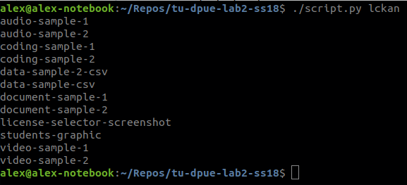
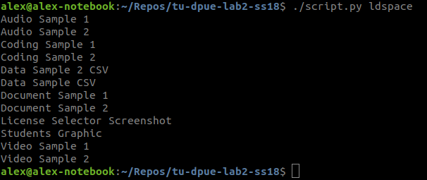
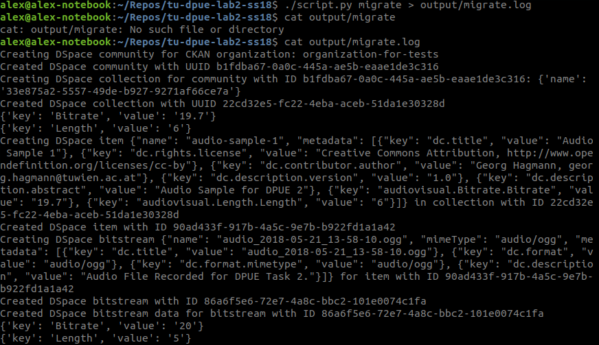
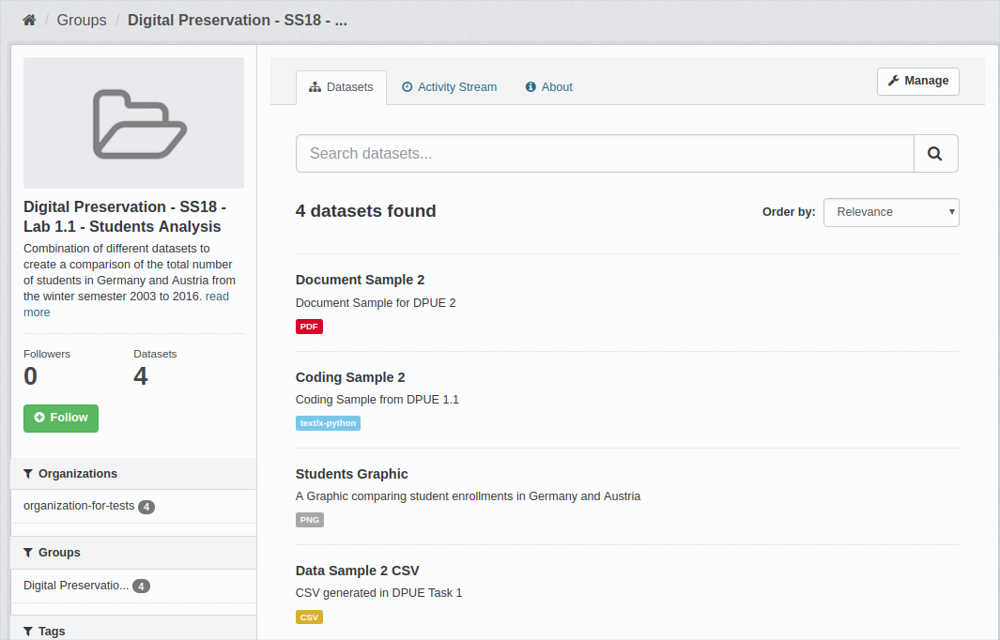
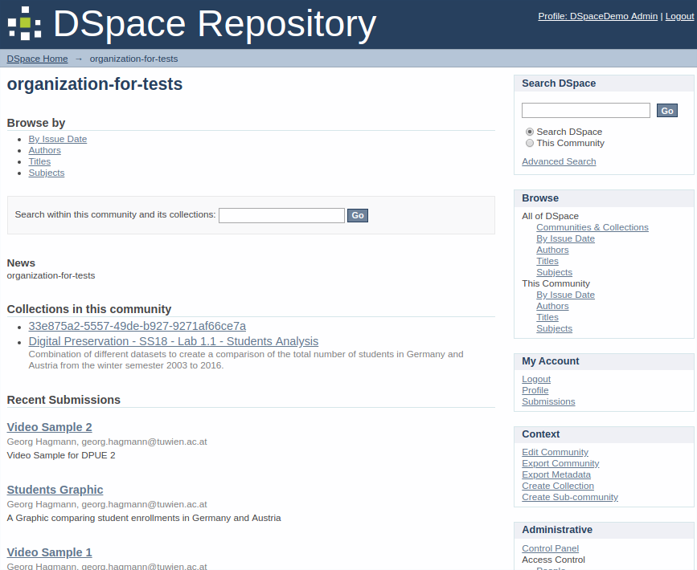
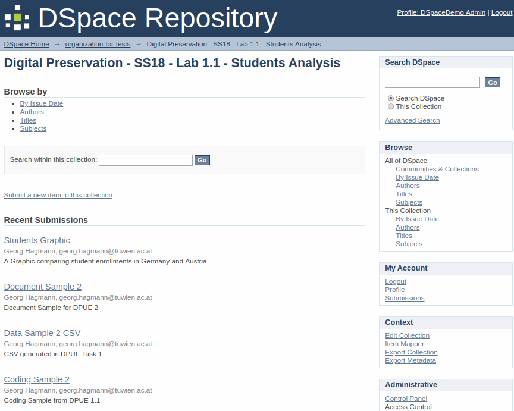
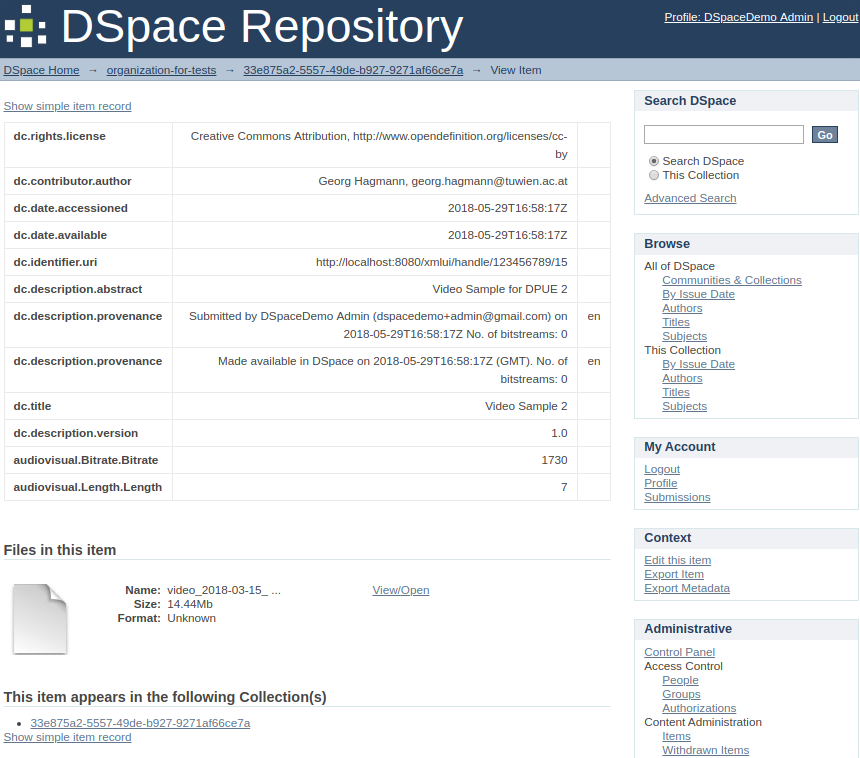

# 188.475 - Digital Preservation - SS18 - Lab 2

- Georg Hagmann, 01226641
- Alexander Rashed, 01325897

#### Description

This script (`script.py`) is used to migrate data from a CKAN repository to a DSpace repository.

#### Preparations

- Install the necessary requirements:

```
pip3 install -r requirements.txt
```

- Configure the properties in `config.ini` 

#### Insert test data

The script `createDatabase.py` inserts the test data into the CKAN repository. Simply execute the script:

```
./createDatabase.py
```

#### Script usage

```
usage: script.py [-h] [-v] command

positional arguments:
  command        Choose ldspace for the list of datasets in the dspace
                 repository, lckan for the list of datasets in the ckan-
                 repository and migrate to migrate data from ckan to dspace.

optional arguments:
  -h, --help     show this help message and exit
  -v, --verbose  Outputs not only the name of the dataset, but the full
                 information available
```

List the content of the CKAN repository (verbose):

```
./script.py -v lckan
```



List the content of the DSpace repository (verbose):

```
./script.py -v ldspace
```



Migrate the data from the CKAN to the DSpace repository:

```
./script.py migrate
```











#### Implementation details

- The script is written in python 3.

- In order to use the CKAN API the official package `ckanapi` is used. The API documentation can be found here: [http://docs.ckan.org/en/ckan-2.7.3/api/](http://docs.ckan.org/en/ckan-2.7.3/api/)

- DSpace does not provide a python package to access the API. The only resource is the (minimalistic) DSpace REST API documentation which can be found here: [https://wiki.duraspace.org/display/DSDOC6x/REST+API](https://wiki.duraspace.org/display/DSDOC6x/REST+API)

#### Implementation challenges

- The DSpace API documentation is not nearly as detailed as necessary. We had to perform endless tries and debugging in order to find out the exact model of the entities, find out how to upload bitstreams and how the metadata is set properly.
- The terminology differs nearly completely between CKAN and DSpace.
- New schema / metadata entries in DSpace do have a unique name persisting even after they are deleted. Therefore it's not possible to import a schema / metadata definition twice.
- In CKAN groups do not have to be associated to a specific organisation and an item does not have to be in a group. In DSpace an item has to be in a collection and a collection is always in a community. Therefore the script creates a default collection for items of a community which are not in a group in CKAN. Their name is random (UUID) to prevent naming conflicts.
- In order to use the DSpace API we had to manually disable the `securityConstraint` in the `web.xml`of the web application and perform a complete rebuild / redeployment.

#### License of this work: [MIT](https://opensource.org/licenses/MIT)